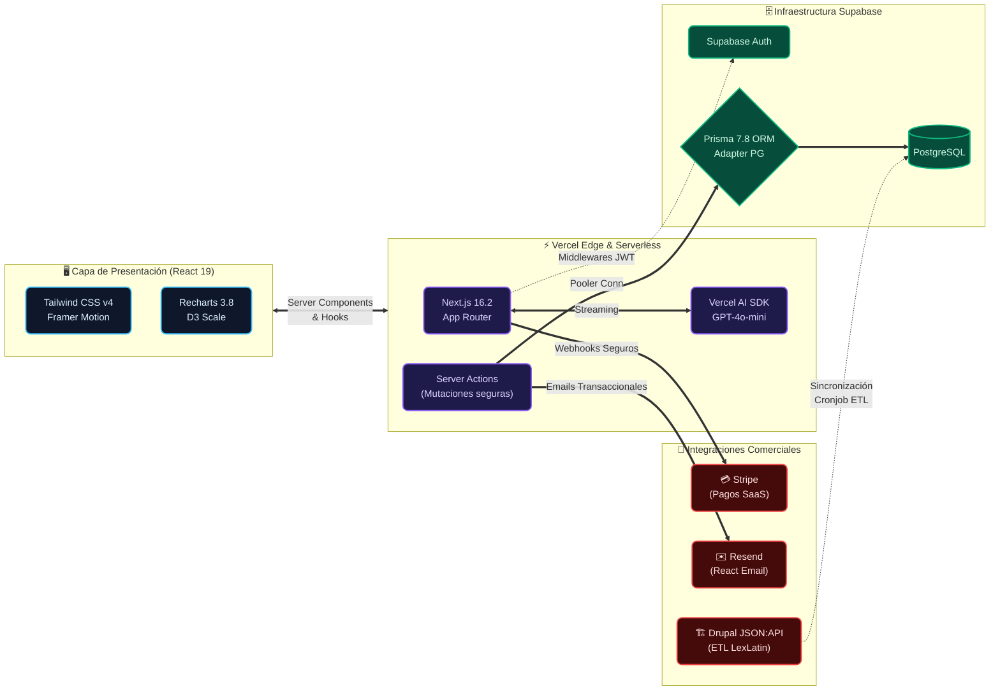
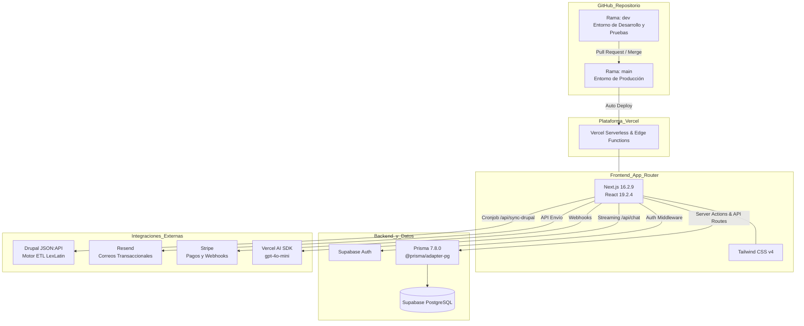

# 📘 Documentación Técnica - Ágora Plus (SaaS) v5.0

Esta es la documentación central del proyecto Ágora Plus. Sirve como referencia para el equipo de desarrollo, DevOps y cualquier nuevo integrante del proyecto.
En la **versión 5.0**, la plataforma incorporó un **Motor de Clasificación de 5 Fases** basado en la Ontología Transaccional oficial (Vol. I, Vol. II y Framework de Clasificación de Ángela Castillo), elevando la precisión de categorización de operaciones corporativas a nivel determinístico. Se agregó **Private Capital** como cuarta familia de operaciones y se implementó un filtro de ruido editorial que separa noticias corporativas/legales de transacciones reales.

---

## 1. Stack Tecnológico y Versiones



* **Framework Core:** Next.js `16.2.9` (App Router).
* **Librería UI:** React `19.2.4`.
* **Estilos:** Tailwind CSS `v4` (PostCSS), animaciones con Framer Motion y Lucide React para íconos.
* **Base de Datos:** PostgreSQL alojado en **Supabase**.
* **ORM:** Prisma `7.8.0` con el adaptador `@prisma/adapter-pg` y librería nativa `pg` para conectividad Edge-ready.
* **Autenticación:** Supabase Auth (`@supabase/ssr` y `@supabase/supabase-js`).
* **Gráficos y Analítica:** Recharts `3.8.1`, `react-simple-maps` y `d3-scale`.
* **Inteligencia Artificial:** Vercel AI SDK 3.x (`@ai-sdk/react`, `@ai-sdk/openai`) usando `gpt-4o-mini`.
* **Comunicaciones:** Resend + React Email para plantillas transaccionales.

### 1.1. Diagrama de Arquitectura y Despliegue (Flujo Git)



---

## 2. Arquitectura del Proyecto

El proyecto está diseñado bajo una arquitectura sin servidor (Serverless) utilizando los últimos estándares de React (Server Components).

* `src/app`: Directorio principal. Las páginas son Server Components por defecto, lo que permite consultas a la base de datos sin exponer APIs intermedias.
* `src/app/api`: Rutas de API y Webhooks (Stripe, Drupal, y el chat endpoint del Copilot).
* `src/app/actions`: Contiene **Server Actions** (ej. mutaciones de Prisma) para formularios y acciones interactivas seguras.
* `src/app/(dashboard)`: Módulo privado para suscriptores protegido por el middleware de Supabase.
* `src/app/dashboard/admin`: Panel central de Administración y Control.
* `src/app/dashboard/copilot`: Interfaz de Inteligencia Artificial Generativa.
* `src/emails`: Componentes de React Email para renderizar notificaciones como `WelcomeEmail` y `DunningEmail`.

---

## 3. Arquitectura de Datos (PostgreSQL) - v4.0

El sistema soporta flujos complejos de SaaS B2B y un CRM/Data-Warehouse integrado:
* **Identidad y Suscripción:** Modelos `User`, `Role` y `Subscription` enlazados a Supabase Auth y Stripe.
* **Copilot Tracking:** Modelo `CopilotUsage` que rastrea la cantidad de consultas LLM hechas por usuario al mes (Rate Limiting de 5 mensuales).
* **Entidades Core:** Modelos `Firm` (Bufete), `Lawyer` (Abogado), `Company` (Empresa), e `Industry` (Industria).
* **Transacciones (Operaciones):** El modelo `Transaction` es el núcleo. Almacena tipo (M&A, Crédito, etc.), montos, fechas de anuncio/cierre y enlace oficial a LexLatin.
* **Relaciones Avanzadas (M-N):**
  * `TransactionCompany`: Define el rol de la empresa en la transacción (Comprador, Target, etc.).
  * `TransactionAdvisor`: Bufetes asesorando en la operación.
  * `TransactionLawyer`: Abogados directamente involucrados.

---

## 4. Flujo de Datos y Diagramas de Conexión (Mermaid)

El siguiente diagrama detalla cómo se orquesta la ingesta de datos en el Backend, desde el CRM heredado (Drupal) hasta llegar a los clientes de React de forma óptima sin colapsar el servidor.

```mermaid
graph TD
    subgraph Origen_Datos
        Drupal[Drupal API Legacy / JSON:API]
    end

    subgraph Backend_ETL
        Cron[Vercel Cron vercel.json] -->|Trigger 0 9 * * *| SyncAPI[/api/sync-drupal]
        SyncAPI -->|Fetch & Parse Paragraphs| Drupal
        SyncAPI -->|Prisma Upsert Atómico| Supabase[(Supabase PostgreSQL)]
    end

    subgraph APIs_Internas
        Supabase -->|Prisma findMany raw| API_Ops[/api/operations]
        Supabase -->|Prisma findMany raw| API_Ind[/api/metrics/industries]
        Supabase -->|Prisma findMany raw| API_Coun[/api/metrics/countries]
    end

    subgraph Frontend_Dashboards
        API_Ops -->|SWR Hook / limit=all| UI_Ops[Módulo Operaciones]
        API_Ind -->|SWR Hook + useMemo| UI_Ind[Módulo Industrias]
        API_Coun -->|SWR Hook + useMemo| UI_Coun[Módulo Países]
    end
    
    UI_Ind -.->|Filtro Dinámico en Memoria| UI_Ind
    UI_Coun -.->|Mapas Interactivos| UI_Coun
```

### 4.1. Detalle de APIs Creadas y Modificadas (v5.0)

*   **`/api/sync-drupal` (El Motor ETL v2.0):** 
    Este endpoint se encarga de importar la información oficial desde LexLatin. En v5.0, integra el **Motor de Clasificación de 5 Fases** (`src/lib/classificationEngine.ts`) que determina el tipo de operación (M&A, Emisiones, Financiamientos, Private Capital) y la industria usando evidencia determinística, scoring ponderado y análisis de roles. **Nota crítica:** Las "Empresas" en Drupal no son entidades directas de la transacción, sino que vienen envueltas en un Párrafo (`paragraph--empresas_involucradas`). La API fue diseñada para "perforar" este párrafo extrayendo el `field_empresa` interno.
*   **`/api/operations` (Histórico Libre):** 
    Recibe un parámetro `limit`. Soporta `limit=all` para descargar toda la base histórica. **v5.0:** Filtra ahora por 4 familias: `M&A`, `Emisiones`, `Financiamientos` y `Private Capital`.
*   **`/api/metrics/countries` y `/api/metrics/industries`:** 
    Despachan un array plano (Raw Data) de las transacciones. El cómputo pesado ocurre exclusivamente en la máquina del cliente, liberando recursos del servidor Vercel.

---

## 5. Módulos Funcionales y Analíticos (UX/UI Premium)

### 5.1. Dashboard de Analíticas (Client-Side Aggregation)
Para lograr una experiencia SaaS fluida donde los mapas y los filtros respondan en menos de `5ms`:
- **useMemo() Dinámico:** Al usar el componente `ProDateRangePicker`, las fechas se filtran sobre la memoria local (`baseFilteredTransactions`), recalculando al instante los "Top Rankings".
- **Desacoplamiento de Mapas Interactivos:** El mapa interactivo lee su estado de un arreglo maestro no afectado por el "Buscador de Texto". Esto permite hacer clics sucesivos en distintos países del mapa sin que el mapa "desaparezca" al filtrarse la tabla principal.

### 5.2. Panel Administrativo (`/dashboard/admin`)
Es el centro de control del SaaS. Protegido por validación estricta de base de datos.
- **Control de Usuarios:** Activar/desactivar el acceso de clientes.
- **Marketing y Tracking:** Expone lectura de los IDs de Google Analytics (GA4), Google Ads y Meta Pixel. Las llaves maestras viven en las variables de entorno de Vercel.

### 5.3. Ágora Copilot (Agentic RAG)
Sistema Multi-Agente con IA Integrada.
- No utiliza un RAG vectorial simple; en su lugar, hace *Function Calling* directamente hacia funciones seguras de Prisma (Tools) para obtener datos matemáticamente exactos.
- Interfaz gráfica fluida con "Generative UI" que renderiza formato Markdown con opciones de descarga de reportes al vuelo (`.md`).

---

## 6. Conectividad e Integraciones Externas

### 6.1. Supabase (Auth y Base de Datos)
* **Autenticación:** Controlada mediante Middleware de Next.js (`src/utils/supabase/middleware.ts`).
* **Base de Datos (Prisma):** La conexión utiliza un **Connection Pooler** IPv4 (Supavisor) a través del adaptador `pg`. Se corre el servidor bajo la URL de Pooler `aws-1-us-east-1.pooler.supabase.com`.

### 6.2. Correos Transaccionales (Resend)
Desacoplados de la interfaz del usuario. Se envían del lado del servidor durante los Webhooks de Stripe (`src/app/api/webhook/route.ts`):
* `checkout.session.completed` ➔ Envia `WelcomeEmail`.
* `customer.subscription.updated` (estado `past_due`) ➔ Envia `DunningEmail`.

---

## 7. Variables de Entorno Críticas (Producción Vercel)

Para que todos los módulos trabajen en sintonía, Vercel debe tener definidas estas variables exactas:
- `OPENAI_API_KEY`: Motor de Inteligencia Artificial para el Copilot.
- `RESEND_API_KEY`: Motor de envío de emails transaccionales.
- `STRIPE_SECRET_KEY` & `STRIPE_WEBHOOK_SECRET`: Cobros y control de acceso.
- `DRUPAL_API_URL`: Fuente de la API de migración de datos.
- `NEXT_PUBLIC_GA_MEASUREMENT_ID`, `NEXT_PUBLIC_META_PIXEL_ID`: IDs de Tracking.

---

## 8. Troubleshooting & Bitácora de Errores (Vercel Build Failures)

Para evitar repetir caídas del entorno de producción durante mantenimientos futuros, revisa esta bitácora:

### Error 1: Type error: Cannot find name 'searchParams'
> [!WARNING]
> **Causa:** Al modificar rutas nativas de App Router (`route.ts`) para eliminar límites o ajustar paginación, es fácil borrar accidentalmente el deconstructor principal `const { searchParams } = new URL(request.url)`. El compilador estricto de TypeScript de Next.js fallará inmediatamente.
> **Solución:** Siempre asegurar que las deconstrucciones del request estén presentes si se invoca un query param.

### Error 2: Missing State Declarations en React
> [!WARNING]
> **Causa:** Referenciar una variable como `dateRange` o su función actualizadora `setDateRange` en un subcomponente sin haber declarado el `useState` nativo en la cabecera del `use client`.
> **Solución:** TypeScript cancela el Build en la nube si hay propiedades (props) fantasmas enviadas a componentes. Revisar siempre los estados en cada reestructuración grande de UI.

### Error 3: La "Trampa de los Paragraphs" en Drupal JSON:API
> [!CAUTION]
> **Problema:** En el módulo `Empresas`, los nombres venían vacíos o nulos.
> **Causa:** Drupal puede esconder entidades reales (`node--empresa`) dentro de envoltorios estructurales conocidos como Párrafos (`paragraph--empresas_involucradas`). Iterar sobre el párrafo no arroja datos corporativos.
> **Solución Arquitectónica:**
> 1. Modificar la URL del request ETL añadiendo encadenamiento profundo en la variable include: `&include=field_empresas_involucradas.field_empresa`
> 2. Iterar en el JSON: aislar primero el ID de relación dentro del párrafo, buscarlo de vuelta en los datos `included` de la respuesta, y finalmente extraer el `.attributes.title` del `node--empresa` genuino.

### Error 4: Límite de Vercel API Deployments
> **Causa:** El plan gratuito de Vercel tiene un límite estricto de 100 despliegues (builds) diarios.
> **Solución:** Cuando se alcanza, Vercel bloqueará los pushes a `main`. Probar los cambios localmente con `npm run dev` intensamente antes de hacer `git push`.

### Error 5: Google Tag Assistant vs Next.js App Router (y AdBlockers)
> [!WARNING]
> **Problema:** Google Tag Assistant marca "0 Etiquetas Encontradas" aunque el script haya sido inyectado exitosamente usando `<GoogleTagManager>` de `@next/third-parties/google`.
> **Causa 1 (Arquitectónica):** El componente oficial de Next.js inyecta el script de manera asíncrona mediante JSON Flight Data. Google Tag Assistant, al escanear el payload inicial del HTML, no detecta físicamente el tag `<script>` tradicional y falla.
> **Causa 2 (Navegador):** Extensiones como AdBlock o uBlock Origin bloquean automáticamente cualquier request hacia `googletagmanager.com`, por lo que el script nunca se ejecuta.
> **Solución Definitiva:** Se removió el componente de Next.js y se optó por la inyección "Raw HTML" oficial proporcionada por Google. Se inyecta un `<script dangerouslySetInnerHTML>` crudo en el `<head>` del `RootLayout` y un `<noscript>` al inicio del `<body>`. Adicionalmente, es estrictamente necesario desactivar los AdBlockers para pruebas con Tag Assistant.

### Error 6: Clasificación Falsa Positiva en el ETL (Emisiones vs M&A)
> [!CAUTION]
> **Problema:** Operaciones de "Emisiones" eran erróneamente clasificadas como "M&A".
> **Causa:** El motor heurístico original leía todo el cuerpo de la transacción (excerpt). Si una emisión mencionaba "adquisiciones" como el fin del capital, el motor la tipificaba mal.
> **Solución Arquitectónica:** Se reescribió el algoritmo en `src/app/api/sync-drupal/route.ts` para usar **Lógica Prioritaria Estricta**. Ahora evalúa exclusivamente el Título (`tx.title`) en la Fase 1 (100% de peso). Solo si el título es inconcluso, se recurre a la Fase 2 (lectura del excerpt).

---

## 9. Estándares de Diseño y UI (v4.0)

### 9.1. Manejo de Variables Confidenciales
En todo el ecosistema Ágora Plus, existe la regla estricta de no usar frases genéricas o informales ("Por definir", "No revelado", "N/A") para referirse a datos financieros no públicos.
- **Estándar Actualizado:** Se debe mapear siempre como **"Valor confidencial"**.
- **Aplicación:** Esto aplica en tablas dinámicas de *Firmas Asesoras, Industrias, Países Involucrados*, en el *Dashboard Global* y en la *Base de Operaciones*. Se maneja dinámicamente en el backend (ej. `api/metrics/firms/route.ts`) o a nivel de renderizado (Frontend `OperationsClient.tsx`).

---

## 10. Motor de Clasificación de Operaciones v2.0

Basado en tres documentos oficiales del owner:
- **Vol. I:** Transaction Ontology (Familias, subtipos, evidencia determinística vs heurística)
- **Vol. II:** Knowledge Graph & Entity Extraction (Entidades, roles, relaciones)
- **Framework de Clasificación v0.1** (Ángela Castillo): Taxonomía editorial, filtro de ruido, evidencia suficiente

### 10.1. Archivo Principal
`src/lib/classificationEngine.ts` — Módulo puro sin efectos secundarios. Exporta:
- `classifyOperationType(title, excerpt, companyRoles)` → `{ type, confidence, phase }`
- `classifyIndustry(text)` → `string | null`

### 10.2. Pipeline de 5 Fases

| Fase | Nombre | Confianza | Criterio |
|------|--------|-----------|----------|
| 0 | Filtro de Ruido | — | Detecta Corporate News / Legal News (nombramientos, litigios, eventos). Si `noiseScore >= 3` y no hay evidencia transaccional → `Operación General` |
| 1 | Evidencia Determinística | HIGH | 100+ keywords que por sí solas identifican el tipo. Título primero, luego texto completo |
| 2 | Scoring Ponderado | MEDIUM | 80+ keywords heurísticas con pesos (1-3). Título recibe multiplicador 2x. Ganador necesita `score >= 3` y ventaja `>= 2` |
| 3 | Confirmación por Roles | MEDIUM/LOW | Roles de empresas de Drupal (Comprador, Emisor, Prestatario, Lead Investor) confirman o desempatan |
| 4 | Fallback Estricto | LOW | Solo asigna tipo si `score >= 3`. De lo contrario → `Operación General` (Review Required) |

### 10.3. Las 4 Familias de Operaciones
1. **M&A** — Adquisiciones, ventas, joint ventures, spin-offs, privatizaciones, LBOs, MBOs
2. **Emisiones** (Capital Markets) — Bonos, IPOs, colocaciones, debentures, CKDs, FIBRAs, titulizaciones
3. **Financiamientos** — Préstamos sindicados, project finance, bridge loans, revolving credit, leasing, factoring
4. **Private Capital** — Series A/B/C/D, seed rounds, venture capital, private equity, growth equity

### 10.4. Clasificador de Industrias
16 clusters de keywords ponderadas (Energía, Minería, Banca, Seguros, Bienes Raíces, Infraestructura, Telecomunicaciones, Tecnología, Salud, Retail, Alimentos, Transporte, Educación, Entretenimiento, Agua, Manufactura). Ganador necesita `score >= 3`.

### 10.5. Procedimiento de Wipe & Re-Sync
1. Ejecutar `scripts/wipe_data.js` (elimina todas las tablas transaccionales respetando FKs)
2. Activar sincronización desde el panel de configuración o POST a `/api/sync-drupal`
3. Toda la data ingresa clasificada por el Motor v2.0 desde el primer registro
